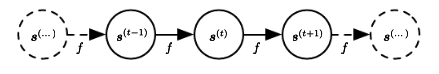
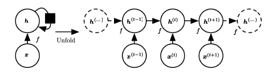
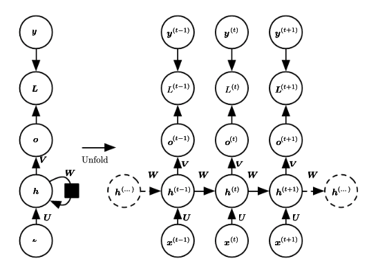
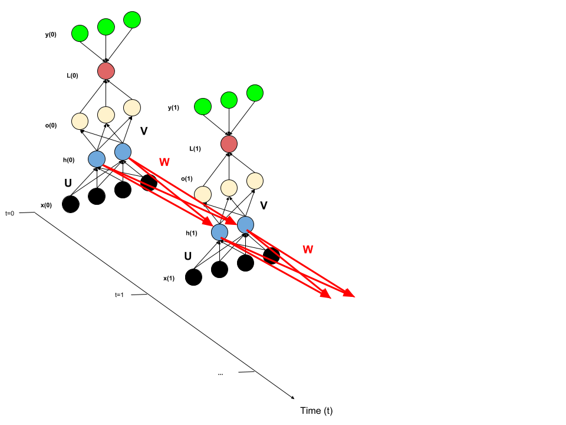

# Recurrent Neural Networks

### By: Collin Brown

## Sequential Models and Computational Graphs

* Thinking about neural network architectures that are designed to process sequence (time-series) data.
* Want to process a sequence of inputs $\mathbf{x}^{(1)}, ...,\mathbf{x}^{(\tau)}$. A "training example" that the RNN operates on is therefore a sequence of these $\mathbf{x}^{(t)}$ vectors, $\{\mathbf{x}^{(1)}, ...,\mathbf{x}^{(\tau)}\}$, where $t$ is the time step index that ranges from $1...\tau$. 
* In practice, RNNs typically operate on mini-batches of these sequences. Note that each sequence in the mini-batch may have a different sequence length, $\tau$. 
* Note that the index $t$ can just refer to the position of an element in a sequence. It does not need to correspond literally to time.
* The RNN architecture can be applied to 2D data as well (e.g. sequences of images).
* We can utilize parameter sharing to generalize across examples of different forms (in the context of RNNs, this means showing sequences of different lengths).

__Parameter Sharing: Convolutional vs. Recurrent Networks__

__Convolutional:__ We "convolve" a kernel over some region of the input space and map it to a region in the output space. So each member of the output is a function of some neighboring set of inputs. 

__Recurrent:__ The previous outputs become arguments for the current outputs. So each member of the output is produced by using the same update rule applied to previous outputs.

### Dynamical Systems as Unfolded Computational Graphs

* Consider a simple dynamical system, where the current state $s^{(t)}$  is determined as a function of (i) the previous state $s^{(t-1)}$ and (ii) some parameter set, $\mathbf{\theta}$. That is, $s^{(t)} = f(s^{(t-1)}, \mathbf{\theta})$. 

* The above figure (Figure 10.1 from [Deep Learning Book, Chapter 10](https://www.deeplearningbook.org/contents/rnn.html)) illustrates the dynamical system governed by $f$ as an unfolded computational graph. 
* As long as the sequence is finite (i.e. $\tau <  \infty$), a cyclic graph representing a recurrent equation can be unfolded to yield a traditional directed acyclic graph (DAG), such as Figure 10.1 above. 
* This is equivalent to showing that we can unfold a recursive equation into a big function composition.

$$
s^{(\tau)} = f(s^{(\tau-1)}, \mathbf{\theta})
$$

$$
s^{(\tau)} = f(f(s^{(\tau-2)}, \mathbf{\theta}), \mathbf{\theta})
$$

$$
s^{(\tau)} = f(f(f(...f(f(s^{(0)}, \mathbf{\theta}), \mathbf{\theta}),..., \mathbf{\theta}),  \mathbf{\theta}), \mathbf{\theta})
$$

* We can expand the above idea by allowing $s^{(t)}$ to depend not only on its previous state $s^{(t-1)}$ and a shared parameter set $\theta$, but also on some external signal $x^{(t)}$ received in each period $t$. 

$$
s^{(t)} = f(s^{(t-1)}, x^{(t)}, \mathbf{\theta})
$$

* This allows us to think about situations where we want the current state to account for information received throughout the whole past sequence as well as the information received in the current step in the sequence. 
* In the context of recurrent neural networks, we want to use an equation similar to the above to define the network's hidden units. So, we rewrite as follows:

$$
h^{(t)} = f(h^{(t-1)}, x^{(t)}, \mathbf{\theta})
$$

* The above equation can be drawn as a computational graph in two different ways. First (left), we can draw it as a circuit diagram with a black square used to indicate a one-step time delay (e.g. from time $t$ to $t+1$). Second (right), we can unfold it and draw it as a directed acyclic graph. The below figure is Figure 10.2 from [Deep Learning Book, Chapter 10](https://www.deeplearningbook.org/contents/rnn.html).

* Note that the model always has the same input size, because it is specified in terms of transitions between states, which is independent of the number of variables in the sequence.
* Note also that it is possible to use the same transition function $f$ with the same parameters at each time step. 
* These two advantages allow a single model, $f$, to be learned that generalizes to all sequence lengths. Also, because of the parameter sharing, significantly fewer parameters need to be estimated, which means that significantly fewer training examples are required to learn $f$ than would be required in the absence of parameter sharing. 

## Recurrent Neural Networks that Produce an Output at Each Time Step

* The idea behind this architecture is to simply map a sequence of input vectors $\{\mathbf{x}^{(1)}, ...,\mathbf{x}^{(\tau)}\}$ to a sequence of output vectors $\{\mathbf{o}^{(1)}, ...,\mathbf{o}^{(\tau)}\}$.
* A loss function $\mathscr{L}^{(t)}$ measures how far off the predicted value $o^{(t)}$ was from the true value $y^{(t)}$. Note that there is a loss for each $t$ in $1...\tau$.

* The connections between the input layer and the hidden layer are parameterized by $\mathbf{U}$, the hidden-to-hidden recurrent connections are parameterized by $\mathbf{W}$, and the connections between the hidden layer and the output layer are parameterized by $\mathbf{V}$. This architecture is illustrated in the simple example below.

* In the example above, there are simple input vectors each containing 4 elements. Each input vector corresponds to a 3-element output vector. There is a hidden recurrent layer that has 2 elements, a 3 element output layer, and the loss function takes the predicted output and the true output in order to compute the loss associated with that particular time step. Notice that the same parameter tensors $\mathbf{U}$, $\mathbf{V}$, and $\mathbf{W}​$ get reused at each time step. Note also that the above diagram does not illustrate the entry of bias vectors.

### Forward propagation of this RNN

* The following system of equations defines forward propagation in the above architecture:

$$
\mathbf{a}^{(t)} = \mathbf{b} + \mathbf{W} \mathbf{h}^{(t-1)} + \mathbf{U} \mathbf{x}^{(t)}
$$

$$
\mathbf{h}^{(t)} = tanh(\mathbf{a}^{(t)})
$$

$$
\mathbf{o}^{(t)} = \mathbf{c} + \mathbf{V} \mathbf{h}^{(t)}
$$

$$
\mathbf{\hat{y}}^{(t)} = \text{softmax}(\mathbf{o}^{(t)})
$$

* $\mathbf{b}$ and $\mathbf{c}$ are bias tensors that enter the hidden and output layers, respectively. $\mathbf{W}, \mathbf{U}, \text{and} \mathbf{V}$ are tensors of parameters that connect hidden-to-hidden recurrent layers, input-to-hidden layers, and hidden-to-output layers, respectively. 
* We can think about a loss function $\mathscr{L}$ over this sequence of input-output pairs $\{\mathbf{x}^{(1)}, ...,\mathbf{x}^{(\tau)}\}; \{\mathbf{y}^{(1)}, ...,\mathbf{y}^{(\tau)}\}$; i.e. $\mathscr{L} \big(\{\mathbf{x}^{(1)}, ...,\mathbf{x}^{(\tau)}\}, \{\mathbf{y}^{(1)}, ...,\mathbf{y}^{(\tau)}\}; \mathbf{\theta} \big)$, where $\mathbf{\theta}$ is a parameter tensor. 
* For a given $t$, we have $\mathscr{L}^{(t)}$, which can be defined as the negative log likelihood of $y^{(t)} | \{\mathbf{x}^{(1)}, ...,\mathbf{x}^{(\tau)}\}$, i.e. $-\text{log} p_{\text{model}} \big( y^{(t)} | \{\mathbf{x}^{(1)}, ...,\mathbf{x}^{(\tau)}\} \big)$.
* Since we are trying to predict an output $o^{(t)}$ that is as close as possible to the true value corresponding to $x^{(t)}$ (i.e. $y^{(t)})$, we want to make this conditional probability as high as possible (i.e. make the negative log of the probability as low as possible). 
* The total loss function can be thought of as simply summing the losses for each $\mathscr{L}^{(t)}$. 

$$
\mathscr{L} = \sum_t \mathscr{L}^{(t)} = -\sum_t \text{log} p_{\text{model}} \big( y^{(t)} | \{\mathbf{x}^{(1)}, ...,\mathbf{x}^{(\tau)}\} \big)
$$

* Calculating the gradient of $\mathscr{L}$ is expensive. To compute this gradient, we must do a forward pass through the recurrent neural network (left to right), and then a backward pass through the network (right to left).
* Further, we have to keep each state from the forward pass in memory for back-propagation.
* This means that both the time and space complexity of this RNN are $O(\tau)$ (i.e. computation time and memory requirements are proportional to the number of examples in the training sequence).
* Note that this time/space complexity cannot be improved through parallelization because the computations involved are inherently sequential. 

### Backpropagation Through Time (BPTT)

* BPTT is procedurally similar to traditional backpropagation, but now we back-propagate through the computational graph across $\tau$ periods. 

* We first note the following:
  $$
  (\nabla_{o^{(t)}} \mathscr{L}) = \frac{\partial \mathscr{L}^{(t)}}{\partial o_i^{(t)}}=\frac{\partial \mathscr{L}}{\partial \mathscr{L}^{(t)}}\frac{\partial \mathscr{L}^{(t)}}{\partial o_i^{(t)}}=\hat{y}^{(t)}_i - \mathbf{1}_{i=y^{(t)}}
  $$

* The way that the total loss ($\mathscr{L}$) changes with respect to the output at each node depends on whether the value that was predicted at that node was correct. So if the above expression was correct, the loss for that node is $0$, otherwise it is $1$. 
* Next, we note that the way that $\mathscr{L}$ changes with respect to the hidden layer at the terminal node ($\tau$) depends only on how $h^{(\tau)}$ affects $\mathscr{L}$ through $o^{(\tau)}$. 

$$
(\nabla_{o^{(t)}} \mathscr{L})
$$

* Finally, we can compute the parameter gradients using $\nabla_{o^{(t)}} \mathscr{L}$ and $\nabla_{h^{(t)}} \mathscr{L}$ as follows:

< insert equations>

* Since recurrent neural networks implement parameter sharing, it can be more difficult to optimize the parameters of the RNN

* Need to understand how to draw samples from the model. 

* RNN needs mechanism for determining the length of a particular sequence (since sequence lengths can vary) 

Ways to do this:

1. create and add a special symbol from the vocabulary that corresponds to the end of a sequence – when this symbol is generated, the sampling stops

2. add an extra Bernoulli output to the model that represents the decision to either halt generation or continue generation at each time step

3. predict $\tau$ directly  and include an input indicating how many steps are left in the sequence

## Long Short Term Memory (LSTM)

## Further Reading

[Deep Learning Book, Chapter 10](https://www.deeplearningbook.org/contents/rnn.html)

[Supervised Sequence Labelling with Recurrent Neural Networks](https://www.cs.toronto.edu/~graves/preprint.pdf)

