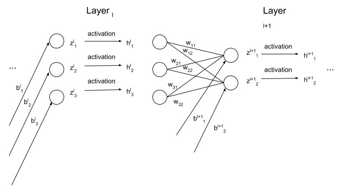

# Part 1: Feedforward Neural Network
### By: Collin Brown 

### Contents:
1. High Level Overview
2. Each Piece of the Code in Detail
3. Neural Network Class

## 1. High Level Overview
The algorithm to create and train a Feedforward Neural Network consists of the following steps:

```
1. Initialize the Neural Network


while (number_epochs < max_epochs)

do

    2. Forward pass 
    3. Calculate Error
    4. Backpropagate Error Through the Network
    5. Update the Model Parameters
    6. Perform Gradient Descent (Batch, Stochastic, or Mini-batch)
```

## 1. Understanding Dimensions at Initialization
```python
    def __init__(self, sizes):
        self.num_layers = len(sizes)
        self.sizes = sizes
        self.biases = [np.random.randn(y, 1) for y in sizes[1:]] 
        self.weights = [np.random.randn(y, x) 
                        for x,y in zip(sizes[:-1], sizes[1:])]
```

* The model parameters consist of the following:
$$
\mathbf{\theta} = \Big[ \big[ \mathbf{W^{0,1}}, \mathbf{W^{1,2}}, ..., \mathbf{W^{L-1,L}} \big], \big[ \mathbf{b^1}, \mathbf{b^2}, ..., \mathbf{b^L} \big] \Big]
$$

* When creating an object of type NeuralNetwork, we initialize weights and biases with random numbers generated from a gaussian standard normal distribution. Note that there are many assumptions you can make when initializing the parameters of a network.
* The biases are a list of 1D numpy arrays and the weights are a list of 2D numpy arrays.
* Note that the biases only enter the network after the 0th layer (i.e. the input layer does not get a bias term).
* Note that the row dimension of the weight matrix depends on the number of neurons in the next layer, while the column dimension of the weight matrix depends on the number of neurons in the current layer.
  
* We have $z^{l+1}_1 = w_{1,1} h^l_1 + w_{2,1} h^l_2 + w_{3,1} h^l_3$, and $z^{l+1}_2 = w_{1,2} h^l_2 + w_{2,2} h^l_2 + w_{3,2} h^l_3$ where $z^{l+1}_i$ refers to the "net input" for layer $l+1$ for the $ith$ neuron.
* We can think of this as a matrix multiplication problem.

$$
\left(\begin{array}{cc} 
w_{1,1} & w_{1,2} & w_{1,3} \\
w_{2,1} & w_{2,2} & w_{2,3} 
\end{array}\right)
\left(\begin{array}{cc} 
h^l_{1} \\ 
h^l_{2} \\
h^l_{3}
\end{array}\right)
$$

## 2. Feedforward
```python
    def feedforward(self, a):
        for b, w in zip(self.biases, self.weights):
            a = sigmoid(np.dot(w, a) + b)
        return a
```
* Zip the lists containing the numpy arrays of biases and weights.
* For each weight matrix sitting between two layers and the corresponding bias vector, apply the activation function (in this example, the activation function is sigmoid).
* This method doesn't keep track of activations in each layer; this happens in the backpropagation method
* ``` np.dot(a,b) ``` is just matrix multiplication if a and/or b are 2D numpy arrays (matricies).
* This code is equivalent to the below line of math:

$$
\left(\begin{array}{cc} 
a^l_1 \\
a^l_2 \\
... \\
a^l_N 
\end{array}\right)
:=
\left(\begin{array}{cc} 
\sigma \big( w_{1,1} a^{l-1}_1 + ... + w_{1,M} a^{l-1}_M + b^{l}_1 \big) \\ 
\sigma \big( w_{2,1} a^{l-1}_1 + ... + w_{2,M} a^{l-1}_M + b^{l}_2 \big) \\
... \\
\sigma \big( w_{N,1} a^{l-1}_1 + ... + w_{N,M} a^{l-1}_M  + b^{l}_N \big)
\end{array}\right)
$$

## 3. Stochastic Gradient Descent
```python
    def SGD(self, training_data, epochs, mini_batch_size, eta,
            test_data = None):
        if test_data:
            n_test = len(test_data)
        n = len(training_data)
        for j in range(epochs):
            random.shuffle(training_data)
            mini_batches = [
                    training_data[k:k + mini_batch_size]
                    for k in range(0, n, mini_batch_size)
                    ]
            for mini_batch in mini_batches:
                self.update_mini_batch(mini_batch, eta)
            if test_data is not None:
                print("Epoch {0}: {1} / {2}".format(j, 
                      self.evaluate(test_data), n_test))
            else:
                print("Epoch {0} complete".format(j))
```
__Digression on Gradient Descent__

* We start by defining a loss function $\mathscr{L}$ which depends on both the data and the model's parameters. Specifically,
$$
\mathscr{L}\Big( \big( \mathbf{x}_{(i)}, \mathbf{y}_{(i)}\big)_{i=1}^N ; \big[ \mathbf{W^{0,1}}, \mathbf{W^{1,2}}, ..., \mathbf{W^{L-1,L}} \big], \big[ \mathbf{b^1}, \mathbf{b^2}, ..., \mathbf{b^L} \big] \Big) = \frac{1}{2} \sum_{i = 1}^N \big( \mathbf{y}_{(i)} - \mathbf{\hat{y}}_{(i)} \big) ^2
$$

$$
\mathbf{\hat{y}}_{(i)} = \text{Classification} \Big( \sigma \big( \mathbf{W^{L-1,L}} \mathbf{a}^{L-1} + \mathbf{b}^L \big)\Big)
$$

$$
\mathbf{a}^{L-1} = \sigma \big( \mathbf{W^{L-2,L-1}} \mathbf{a}^{L-2} + \mathbf{b}^{L-1}\big)
$$

$$
...
$$

$$
\mathbf{a}^{1} = \sigma \big( \mathbf{W^{0,1}} \mathbf{x_{(i)}} + \mathbf{b}^{1}\big)
$$

* Our aim is to __choose the parameters__ of $\mathscr{L}$ in such a way to minimize the value that $\mathscr{L}$ takes on (i.e. "minimize the loss function").
$$
\min_{\mathbf{\theta}}  \mathscr{L}\Big( \big( \mathbf{x}_{(i)}, \mathbf{y}_{(i)}\big)_{i=1}^N ; \mathbf{\theta} \Big)
\$$

* The surface of $\mathscr{L}$ exists in some high dimensional parameter space.

--> Insert figure or draw on board

* When weights are initialized randomly, we show up at some point on the surface of $\mathscr{L}$. 

* The gradient points in the direction of steepest __ascent__; if we multiply the gradient by $-1$, it points in the direction of steepest __descent__.

* Starting from a random point on $\mathscr{L}$ (i.e. given a random set of parameters $\mathbf{\theta}$), for each parameter $\theta_i \in \mathscr{\theta}$, we can calculate $\frac{\partial \mathscr{L}}{\partial \theta_i}$.

* Since $(-1) \nabla \mathscr{L}$ points in the direction of steepest descent, we're "pushing" each parameter $\theta_i$ in such a way that after applying the following update rule:
$$
\theta_i' := \theta_i - \eta \frac{\partial \mathscr{L}}{\partial \theta_i} 
$$

$$
\mathscr{L}\Big( \big( \mathbf{x}_{(i)}, \mathbf{y}_{(i)}\big)_{i=1}^N ; \mathbf{\theta}' \Big) \leq \mathscr{L}\Big( \big( \mathbf{x}_{(i)}, \mathbf{y}_{(i)}\big)_{i=1}^N ; \mathbf{\theta} \Big)
$$

__training_data__: A set of (x, y) tuples representing the input-label pairs. Note that x has the dimensions of the input layer and y has the dimensions of the output layer. A tuple (x, y) represents a single observation.
__epochs__: The number of times that we want to pass over the entire training set.

__mini_batch_size__: The size of mini-batches to be used.

__Digression on Types of Gradient Descent__

1. There are three types of gradient descent: (1) Batch (2) Stochastic (3) Mini-batch
    1. With __batch__ gradient descent, the entire training set (i.e. every single (x, y) pair that is contained in the training set) is passed through the network before any update to the weights/biases happen. This can make model updates computationally slow with large datasets (b/c it takes much longer to perform a signle update on the network) and can sometimes lead to convergence to non-optimal local minima due to the gradient being very stable.
    2. With __stochastic__ gradient descent, the network parameters are updated every time a single (x, y) pair is passed through the network. This process makes the gradient very noisy, making it hard for the model to converge to an optimum.
    3. With __mini-batch__ gradient descent, a subsample of the training set is used to calculate the gradient (e.g. 32 or 64 (x, y) tuples). This type of gradient descent is most commonly used in practice, as it achieves some gradient stability (but still allows the gradient to explore so as to not get stuck in a non-optimal minima) and provides frequent updates to the network parameters without performing an update calculation after every single (x, y) tuple gets passed through the network.


__eta__: The learning rate parameter that tells the update rule how much emphasis it should place on the gradient's update with respect to a particular weight or bias.

* For each epoch in the number of epochs the user chooses, the code above shuffles the ordering of the training data, breaks the training data into mini batches.

* For every mini batch in the set of mini batches calculated above, pass the mini batch to the **update_mini_batch()** method.

* If the user passes test data to the network, this method prints progress updates to the console.

## 4. Update Mini Batches
```python
    def update_mini_batch(self, mini_batch, eta):
        # Initialze the gradients for network biases and weights to contain 
        # zeros for the conformable number of dimensions
        nabla_b = [np.zeros(b.shape) for b in self.biases]
        nabla_w = [np.zeros(w.shape) for w in self.weights]
        # For each (x, y) pair in the mini-batch, calculate the gradient 
        # associated with each pair, then add them together
        for x, y in mini_batch:
            # For a single (x, y) pair, return the weight/bias gradients
            delta_nabla_b, delta_nabla_w = self.backprop(x, y)
            nabla_b = [nb + dnb for nb, dnb in zip(nabla_b, delta_nabla_b)]
            nabla_w = [nw + dnw for nw, dnw in zip(nabla_w, delta_nabla_w)]
```
* The code above initializes a list of 1D numpy arrays for each layer's bias and a list of 2D numpy arrays for the weight matrices sitting between each layer.
* Then, for every (x, y) tuple (observation) contained in the mini batch, calculate the gradient with respect to the biases and weights for each layer. That is,
$$
\nabla b^l
=
\left(\begin{array}{cc} 
\frac{\partial L}{\partial b^l_1} \\ 
\frac{\partial L}{\partial b^l_2} \\
... \\
\frac{\partial L}{\partial b^l_{N_l}}
\end{array}\right)
$$ and
$$
\nabla W^{l, l + 1}
=
\left(\begin{array}{cc} 
\frac{\partial L}{\partial w_{1,1}}, \frac{\partial L}{\partial w_{1,2}}, ..., \frac{\partial L}{\partial w_{1,N_l}} \\ 
\frac{\partial L}{\partial w_{2,1}}, \frac{\partial L}{\partial w_{2,2}}, ..., \frac{\partial L}{\partial w_{2,N_l}} \\ 
... \\
\frac{\partial L}{\partial w_{N_{l+1},1}}, \frac{\partial L}{\partial w_{N_{l+1},2}}, ..., \frac{\partial L}{\partial w_{N_{l+1},N_l}}
\end{array}\right)
$$.
* The rest of the function follows.
```python
        # After the entire minibatch has been iterated over, update the
        # network's weights and biases with the average nabla_w/nabla_b
        # in the mini-batch
        self.weights = [w - (eta / len(mini_batch)) * nw 
                        for w, nw in zip(self.weights, nabla_w)]
        self.biases = [b - (eta / len(mini_batch)) * nb 
                       for b, nb in zip(self.biases, nabla_b)]  
```
* Once all of the gradients are calculated, update the lists of weights and biases by applying the following update rules.

$$ W^{l, l+1} := W^{l, l+1} - \eta \nabla W^{l, l+1}$$ 

$$ b^l := b^l - \eta \nabla b^l $$

## 5. Backpropagation
```python
    def backprop(self, x, y):
        # Initialize numpy arrays that store the gradients
        nabla_b = [np.zeros(b.shape) for b in self.biases]
        nabla_w = [np.zeros(w.shape) for w in self.weights]
        # Feedforward step
        # Note that the first activation is simply the input, x
        activation = x
        activations = [x]  # list to store all of the activations layer by layer
        zs = []  # List to store the net input vectors, layer by layer
        # For all weights and biases, feed the input forward through the
        # network
        for b, w in zip(self.biases, self.weigths):
            # Compute net input for the current layer
            z = np.dot(w, activation) + b
            # Add most recent net input to the list of net inputs
            zs.append(z)
            # Pass net input through the activation function
            activation = sigmoid(z)
            # Add most recent activation to the list of activations
            activations.append(activation)
```
* The above code starts with the input data 'x' and feeds it forward through the network.
* Intermediate activations and net inputs are stored in variables 'activation' and 'z'.
* Next, there is a backward pass through the network, where the network's parameter gradients are calculated.
```python
        # Backward pass through the network
        # Calculate error associated with the weights and biases of the final
        # layer of the network (This is equation BP1 from MN book)
        delta = self.cost_derivative(
                activations[-1], y) * sigmoid_prime(zs[-1])
        # Gradient of cost wrt bias is just delta (eq BP3)
        nabla_b[-1] = delta
        # Gradient of cost wrt weights is the errors of layer l multiplied by 
        # the activations of layer l-1
        nabla_w[-1] = np.dot(delta, activations[-2].transpose())
        # For every additional layer in the network, compute nabla_b and
        # nabla_w
        for l in range(2, self.num_layers):
            z = zs[-l]
            sp = sigmoid_prime(z)
            delta = np.dot(activations[-l].transpose(), delta) * sp
            nabla_b[-l] = delta
            nabla_w[-l] = np.dot(delta, activations[-l - 1].transpose())
        # Return a tuple of gradients for the biases and weights of the network
        return (nabla_b, nabla_w)
```
## Motivation for Backpropagation
* We need to find $\frac{\partial \mathscr{L}}{\partial w_{i, j}^{l-1,l}}$ and $\frac{\partial \mathscr{L}}{\partial b_{i}^{l}}$ for all $i, j, \text{and} l$ to compute our gradient vectors.

* From the chain rule in calculus, we know the following:

$$
\frac{\partial \mathscr{L}}{\partial w_{i, j}^{l-1,l}} = 
\frac{\partial \mathscr{L}}{\partial a_i^l}
\frac{\partial a_i^l}{\partial z_i^l}
\frac{\partial z_i^l}{\partial w_{i, j}^{l-1,l}}
$$

and

$$
\frac{\partial \mathscr{L}}{\partial b_{i}^{l}} = 
\frac{\partial \mathscr{L}}{\partial a_i^l}
\frac{\partial a_i^l}{\partial z_i^l}
\frac{\partial z_i^l}{\partial b_{i}^{l}}
\$$
$$
INSERT DIAGRAM 

* We know that $\frac{\partial z_i^l}{\partial w_{i, j}^{l-1,l}} = a_{j}^{l-1}$ because

$$
\frac{\partial}{\partial w_{i, j}^{l-1,l}} \Big( \sum_{k=1}^{N_l} w_{k,i}^{l-1,l} a_k^{l-1,l} + b_i^l  \Big) = a_k^{l-1} \forall k \in N_l
$$

* Intuitively, the way that the above expression changes with respect to weight $w_{i, j}^{l-1,l}$ depends only on the activation in the previous layer that is connected to the net input through this weight. Therefore, the way that the net input changes with respect to this weight is simply equal to the activation in the previous layer, $a_j^{l-1}$.

* Further, we also know that $\frac{\partial z_i^l}{\partial b_{i}^{l}} = 1$ because

$$
\frac{\partial}{\partial b_{i}^{l}} \Big( \sum_{k=1}^{N_l} w_{k,i}^{l-1,l} a_k^{l-1,l} + b_i^l  \Big) = 1 \forall k \in N_l
$$


* So, we can simplify the original expressions to the following:

$$
\frac{\partial \mathscr{L}}{\partial w_{i, j}^{l-1,l}} = 
\frac{\partial \mathscr{L}}{\partial a_i^l}
\frac{\partial a_i^l}{\partial z_i^l}
(a_{j}^{l-1})
$$

and

$$
\frac{\partial \mathscr{L}}{\partial b_{i}^{l}} = 
\frac{\partial \mathscr{L}}{\partial a_i^l}
\frac{\partial a_i^l}{\partial z_i^l}
(1)
$$.

* However, it is still not clear how we calculate $
  \frac{\partial \mathscr{L}}{\partial b_{i}^{l}} = 
  \frac{\partial \mathscr{L}}{\partial a_i^l}
  \frac{\partial a_i^l}{\partial z_i^l}$ for each $i$ and $l$. 

### Solution: Create an artificial variable "error" variable called $\delta^L$, and backpropagate it through the network.

* We define an artificial "error" variable in the following way:
$$
\delta^L = (\sigma(z^L) - y) \odot \sigma ' (z^L)
$$

* where $(\sigma(z^L) - y)$ plays the role of a feedback signal, $\sigma ' (z^L)$ is the contribution that the net input of the final layer made to the "decision" of the network, and $\odot$ is the hadamard product operator, which means to take the element-wise product of the two above vectors.

* We "flip" the network around, so that the output layer becomes the input layer, and treat $\delta^L$ (i.e. the error for the output layer) as the input to this reversed network.

INSERT DIAGRAM

* To feed $\delta^L$ back one layer, we do the following matrix multiplication: $(W^{L-1,L})^T \delta^L$